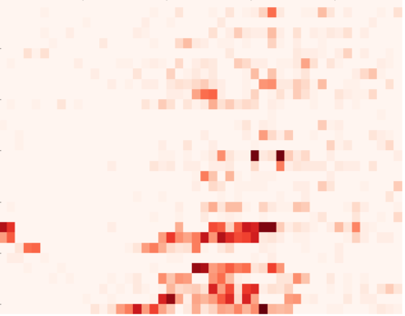
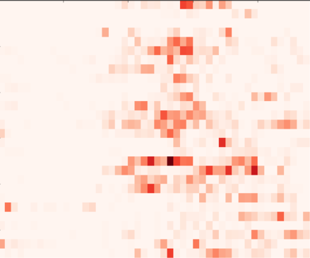
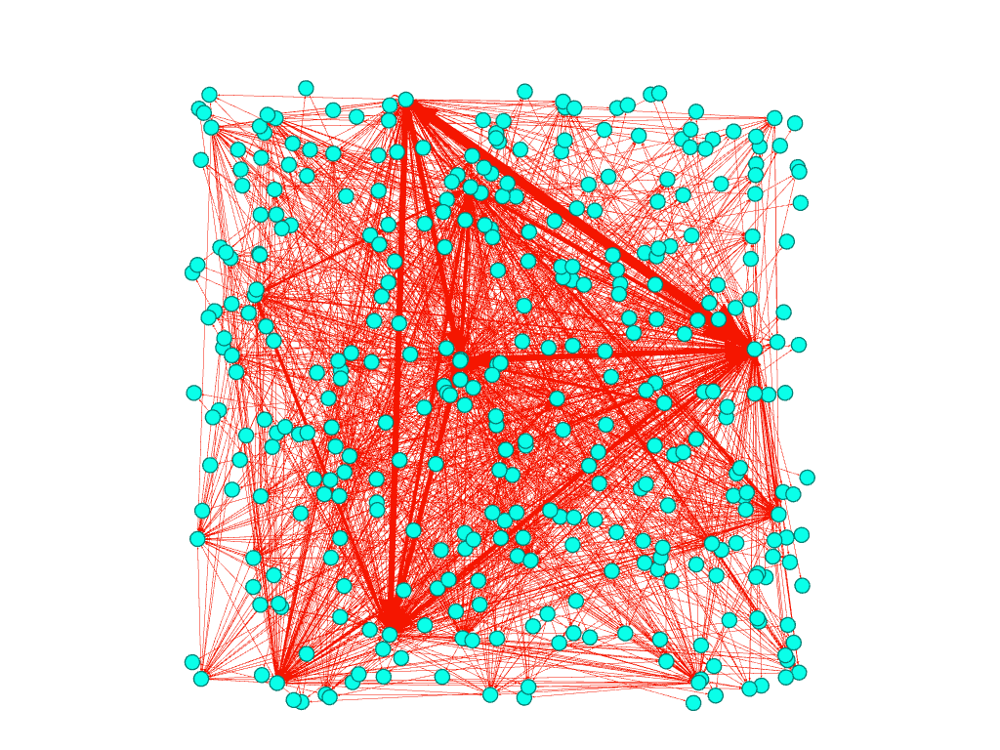
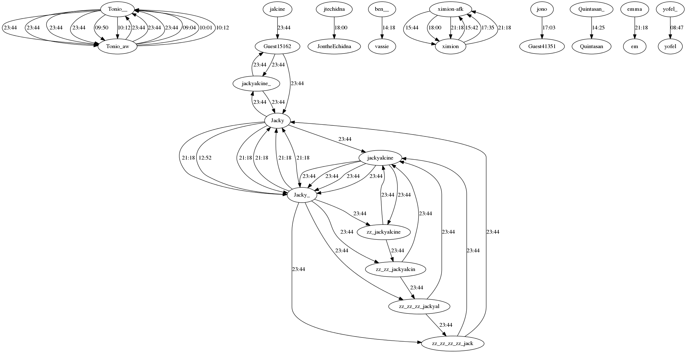

Analysis Techniques
===================

This section consists of different analysis procedures that are used by our IRCLogParser for examining the user interactions from different IRC channels.

=======
HeatMap
=======

Heat Map of an IRC channel provides us with information about the total number of messages that were transmitted in a certain amount of time i.e. 30 minutes in our case. Hence, for a day we obtain 48 bins of 30 minutes each with each bin consisting of a number equal to the total messages transmitted between any pair of users on the channel in that time frame (30 mins). Heat Maps are very useful as they assist us in making predictions about the probability of a query being answered or a reply being sent during a particular time period of a day.

1 Jan 2013, #kubuntu-devel Heatmap  :

2 Jan 2013, #kubuntu-devel Heatmap 	:

==============================
Aggregate and Temporal Graphs
==============================

These are simple-weighted directed graphs with IRC channel users drawn as nodes and a directed edge drawn between two users symbolizing the number of message sent from a user to another. The graph is 'aggregate' as it can be drawn and analysed for a whole year. Aggregate graphs give us facts and figures about the degree distribution of each node i.e the number of messages sent(out-degree) and received(in-degree) by a user, and they can also use algorithms such as InfoMaps to detect the community of experts on an educational channel. On the other hand, temporal graphs are produced on a per-day basis and have edges between users for every message being transmitted with the edge weight being equal to time at which the message was transmitted. This can be useful for analyzing the conversation and response time behaviors between two or more users on any IRC channel.

=====================
Sliding Window Graphs
=====================

These graphs are not fixed or bound by time frames and can be produced for any time period. We just need to specify that time period through the IRCLogParser interface. We can thus say that the union of all Sliding Window Graphs for a particular year can be termed as an Aggregate Graph. These graphs are very useful for performing per-day or per-hour analysis of the IRC chat logs.

=============================
Communication Activity Graph
=============================

These graphs are produced after assigning users to different groups that are basically just collections of users that interact the most among each other on a channel. If a group has users A, B and C in it, then every dot in front of A represents a message sent to either B or C. This provides a very robust and clear visualization of the IRC social network and tells us a lot about the strengths of relationship between different users on a channels.

=====================
Nickname Change Graph
=====================

This graph can be used to track the patterns of the nickname changes of various different users on an IRC channel. It also records the nicknames of the same users active on different channels. These graphs are useful for gauging a particular user's interests and his degree of activeness on a particular channel.

