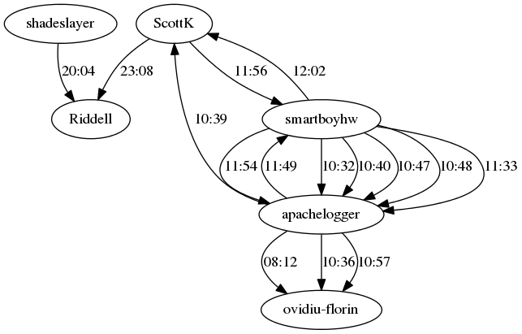

What is IRCLogParser?
=====================

In the field of social networking there exists a social structure which consists of various social actors (individuals, groups or organisations) along with the interactions between these actors. The social network perspective provides a complete set of methods for analyzing the observed entities, dynamics and patterns in a social structure. It marks the emergence of the field of social network analysis which is now one of the major paradigms in contemporary sociology, and is also employed in a number of other social and formal sciences.

The objective of this project is to utilize social network analysis techniques to examine the relationships between actors on the Internet Relay Chat(IRC) social networking service. The IRCLogParser is an application that accepts IRC log files from different channels and parses them to analyse the principles of interaction between IRC users. Study of these interactions on different levels helps us in deriving the local and global communication patterns between users on different channels. Therefore, IRCLogParser draws its inspiration from various fields such as data mining, graph theory and inferential modeling in order to form predictive models that help in understanding certain intricate characteristics of a social network. This involves analyzing graphs with IRC users(nodes) and their connections(edges), to study the details about various network graph properties such as density, size, node centrality, degree, connectedness etc.